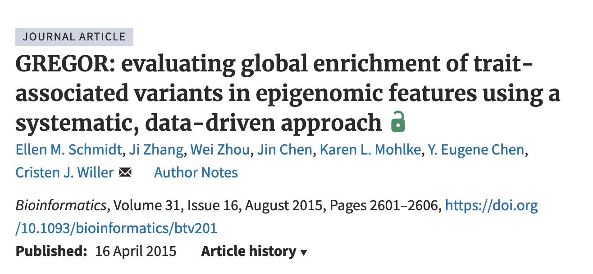

## Gregor API

####  Explored by: 

`Ravi Mandla`,`Eric Ham`-`(Bioinformatics 201, Fall-2023, UCLA)`

---------

--------

### Description: 

GREGOR is a tool to test for the enrichment of variants associated with a phenotype within annotated epigenomic regions. It works by doing the following: 

1. Accounting for LD between variants and regions
2. Picking control variants matching the input variants by the number of variants in LD, MAF, and distance to the nearest gene

GREGOR can be downloaded from the [wiki](https://genome.sph.umich.edu/wiki/GREGOR), where further documentation can also be found. The original paper can also be found [here](https://doi.org/10.1093/bioinformatics/btv201).

### Tutorial: 

We created a tutorial to use GREGOR to test for enrichment between association statistics and genomic regions available [at this link](https://colab.research.google.com/drive/1iwNnEjuJbJ9pyQ9KG7inCQt1LQzlJxTQ?usp=sharing)

### Use cases: 

we present two cases centered around analyzing rare cell types.

1. Task: Given a scRNA-seq data set with rare cell types, identify the marker genes
Background: To better understand rare cell types, we can identify genes that are
distinct in their gene expression profile
Goal: Identify marker genes for rare cell types
Method: API pipeline with some downsampling to balance class sizes
Outcome: Marker genes for rare cell types

2. Task: Given a scRNA-seq data set with rare cell types, construct a trajectory mapping
the relationships between all cell types
Background: To better understand rare cell types, we can look at their ontological
frame with respect to other cell types mapped in some embedding space
Goal: Append rare cell types to lineage tree of more common cell types
Method: API pipeline with a separate projection of rare cell types to embedding after
initial trajectory construction
Outcome: Cell type trajectory
