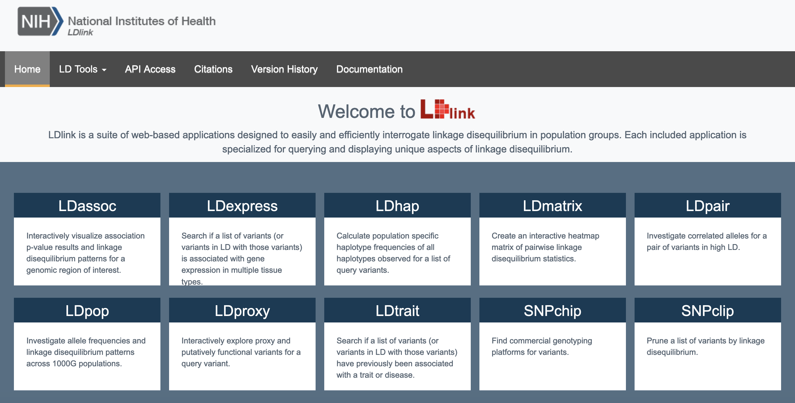

## LDlink API

####  Explored by: 

`Ravi Mandla`,`Eric Ham`, `Xinzhe Li`, -`(Bioinformatics 201, Fall-2023, UCLA)`

---------

--------

### Description: 

LDlink is a an online database to identify variants in LD with an specified input variant within different populations of 1000G. There are several modules within LDlink with different
tasks, including:

1. LDproxy - Identify variants in LD with a specified variant
2. LDtrait - Test if a specified variant, or a variant in LD, has been identified as associated with a phenotype.
3. LDexpression - Test if a specified variant, or a variant in LD, has been identified as associated with gene expression.
4. etc...

A full list of all the modules available at LDlink can be found [here](https://ldlink.nih.gov/?tab=home). This NIH supported resource also provides API code to programmatically search
different modules for specific data. Instructions on getting access to this API and example use cases can be found [here](https://ldlink.nih.gov/?tab=apiaccess).

### Tutorial: 

We created a tutorial to use LDlink to download a list of variants in LD with a specified variant [at this link](https://colab.research.google.com/drive/1vBk1XutVZIHtuxYq4zJCBcR6lZA1EcIx?usp=sharing).

### Use cases: 

1. LDHap identifies all possible haplotypes for a list of variants and then determines the frequencies with which each haplotype is inherited for a given input population. For example, say you performed a genome wide association study (GWAS) and found that a particular set of variants are predictive of a phenotype like disease state. LDHap would allow you to identify whether this set of variants is likely to be inherited together as a haplotype.
2. Visualize the LD structure of a genomic region. LDmatrix is another module that creates a matrix of pairwise LD statistics (R^2 or D’) for an input list of variants. This gives you an idea of whether two variants are likely to be inherited together. This matrix can be used to create heatmaps to visualize the LD information in a specific region, or can be used to generate a reference panel to be used in different downstream analyses.

## Comparing the genetic architecture of eQTL results with that of different traits:
1. **Task**: Given a list of variants identified in an eQTL, identify which are associated with a trait.
    * **Background**: A majority of variants associated with a trait are non-coding, raising the possibility they may be involved in gene regulation. In addition, multiple sequencing sites have generated joint modality profiling such as RNA sequencing (bulk and single cell) along with DNA sequencing result from the same individual, allowing eQTL calling and functional identification on how these non-coding SNPs could be associated with gene expression level. Exploring how eQTL datasets and GWAS overlap can better shed light on the function of these non-coding variants.  
    * **Goal**: Identify traits which have an overlap of associations with eQTL from a specific tissue.
    * **Method**: Pull all variants, or LD proxy variants, associated with an eQTL and a different set of traits. 
    * **Outcome**: Variant IDs, LD information, the number of associations in both an eQTL and a specified set of traits, and summary statistics for the associations.
2. **Method**:
    * **step1**: pull eQTL variants from GTEx using the GTEx [api](https://gtexportal.org/api/v2/redoc#tag/Static-Association-Endpoints/operation/get_significant_single_tissue_eqtls_api_v2_association_singleTissueEqtl_get) to obtain summary statistic files for genome-wide significant single-tissue eQTLs for each tissue separately. Primarily we will need gene ids, variant ids, and tissue type information. 

    * **step2**: using LDtrait API, input the list of variants from the summary statistic file we pulled previously from GTEx. Since GTEx participants are mostly of European ancestry, we can specify to only consider EUR LD information and include only associations in LD with an eQTL by an R2 cutoff of 0.8. With LDtrait, we will get a table of all GWAS catalog associations for our input variants or variants in LD with our input variants via our R2 cutoff.

    * **step3**: merge the table form step 1 and step 2 together to obtain variants associated within LD to each traits with respect to tissue types.
  
## Expected output:
the expected output will be a dataframe containing the following information from LDtrait API and GTEX eQTL:
1. The input variant to LDtrait
2. GWAS trait that the SNP is assocaited with.
3. PMID for publication supporting the result
4. RSID for each SNP
5. chromosomal location for the SNP
6. Allele frequencies
7. R^2
8. D' LD statistic
9. Risk allele frequncy (from GWAS catalogue)
10. odd risk or beta
12. effect size confidence interval
13. p value for each snp
13. Additional columns with respect to the summary statistics from eQTL studies.
